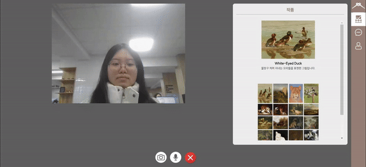

# ANUDAR 

### 프로젝트 진행 기간

2024.01.03(수) ~ 2024.02.16(금)

 

## 🤗 Team Members

    <table>
        <tr>
            <td align="center">
            
            </td>
            <td align="center">
                
            </td>
            <td align="center">
                
            </td>
            <td align="center">
                
            </td>
            <td align="center">
                
            </td>
            <td align="center">
                
            </td>
        </tr>
        <tr>
        <td align="center">
            <a href="https://github.com/nks211?tab=repositories">
            김민우
            </a>
        </td>
        <td align="center">
            <a href="https://github.com/rigoood">
            박규리
            </a>
        </td>
        <td align="center">
            <a href="https://github.com/sarang682">
            박사랑
            </a>
        </td>
        <td align="center">
            <a href="https://github.com/YUNA-AHN">
            안유나
            </a>
        </td>
        <td align="center">
            <a href="https://github.com/">
            조수현
            </a>
        </td>
            <td align="center">
            <a href="https://github.com/suyeon-hyeon">
            현수연
            </a>
        </td>
        </tr>
        <tr>
            <td align="center">FrontEnd</td>
            <td align="center">FrontEnd</td>
            <td align="center">BackEnd</td>
            <td align="center">BackEnd</td>
            <td align="center">BackEnd</td>
            <td align="center">BackEnd</td>
        </tr>
    </table>

 

## 🎈 등장 배경

온라인에서 신진 작가의 작품을 감상하거나 작품을 직접 구매하여 컬렉션에 추가하고 싶으셨나요?

높은 전시회 대관료로 인해 자신만의 전시회를 열기를 두려웠던 적 있나요?

"ANUDAR는 당신이 만든 작품을 통해 누구나 작가가 될 수 있는 플랫폼입니다."
 

## 📚 개요

아누다(ANUDAR)란 스폐인어로 <strong>매듭을 만들다, 맺다</strong>라는 의미로

자신의 작품을 다른 사람들에게 알리고 싶은 예술가분들, 신진 작가의 작품을 감상을 원하는 모두에게

언제 어디서든 인터넷만 있다면 쉽고 편리하게
여러 작품을 감상하고 도슨트를 듣고 경매를 할 수 있는 서비스 입니다.
 

## 💻 기술 스택

- Backend
  - SpringBoot
  - SpringBoot Security
  - Gradle
  - JWT
  - WebSocket
  - Mysql
  - Openvidu
  - AWS S3
  - Redis

- Frontend
  - NodeJS
  - React
  - StompJS
  - Axios
  - zustand
  - three

- Infra
  - Ubuntu
  - Nginx
  - Docker
  - Jenkins

 

## 🐣 아키텍처

## 🚀 주요기능 및 화면

### 3D 전시회
- 여러분의 전시회를 2D뿐만 아니라 three.js를 활용한 3D로도 선보일 수 있습니다. 입체적인 감상을 통해 작품의 매력을 한층 더 느낄 수 있습니다.

### 온라인 도슨트 
- 전시회 작가의 생생한 작품 설명을 온라인 도슨트를 통해 직접 들어보세요. 각 작품에 담긴 이야기와 영감을 생동감 있게 전달할 수 있습니다.

### 녹화
- 시간이 맞지 않아 도슨트에 참여하지 못했더라도 녹화되어 언제든지 다시 시청 가능합니다.

### 온라인 경매
- 작품에 대한 관심을 반영하여, 찜한 횟수가 많은 상위 20개의 작품들을 경매 리스트에 보냅니다. 마음에 드는 작품을 발견하셨다면 경매에 응찰할 수 있습니다.

### 포인트 구매
- 카카오페이 API를 통해 포인트를 충전하고, 이 포인트로 경매에 참여해 원하는 작품을 획득할 수 있습니다.

